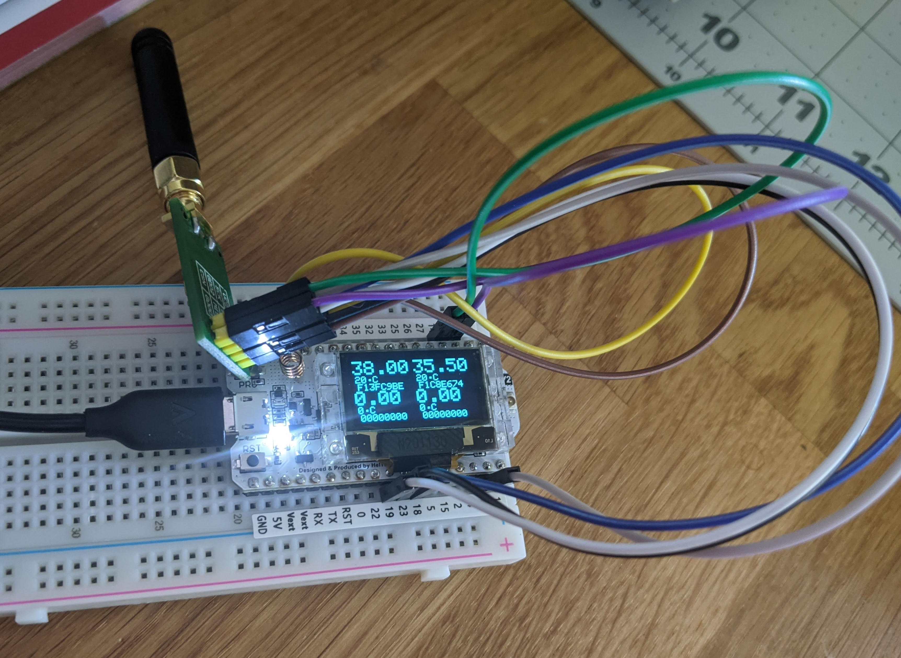

# Toyota Lexus 315mhz TPMS monitor for Heltec WiFi LoRa 32 (v2)

This is a sample project for building a TPMS monitor for Toyota/Lexus equipped sensors that follow 315mhz TPMS protocol

(FCC ID lookup: https://fccid.io/PMVC010 more specifically PAXPMVC010)

# Required Gear
- Heltec ESP32 WiFi LoRa 32 (V2)
- Texas Instruments CC1101

# Build requirements
- Project is setup in PlatformIO, baud rate (115200) and required libs will be handled at build time in PlatformIO.

# For this to support other TPMS systems over 315mhz or 433mhz
- Sample a few radio signals with RTL-SDR using URH (https://github.com/jopohl/urh) 
- Reverse engineer the protocl based on signal
- Or potentially find relevante FCC filing that may have specifics available (FSK vs ASK)

## Additional Sources:
- https://www.hackster.io/jsmsolns/arduino-toyota-uk-tpms-tyre-pressure-display-b6e544 from JSMSolns
- https://github.com/xnk/pacific-tpms
- https://github.com/merbanan/rtl_433/blob/master/src/devices/tpms_toyota.c

## Project initailly forked from: https://github.com/c-logic/tpms_toyota but required changes to Heltec ESP32 pin outs and PlatformIO support.
